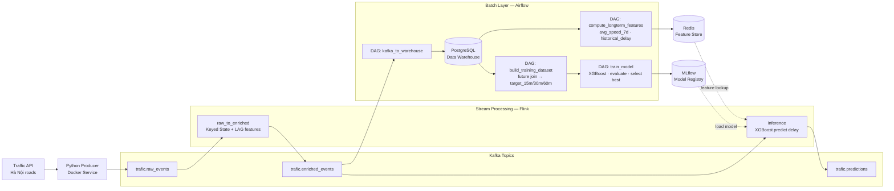

# Big Data Traffic Prediction Pipeline

Hệ thống dự đoán tình trạng giao thông realtime tại Hà Nội sử dụng kiến trúc Lambda lite, kết hợp stream processing và batch ML training.

## Architecture



## Data Flow

### Realtime Path (Speed Layer)

```text
Traffic API
  → Python Producer (Docker, restart: unless-stopped)
  → Kafka [trafic.raw_events]
  → Flink raw_to_enriched
      KeyedProcessFunction theo road+district+city
      Tính: prev_speed_1/2/3, rolling_avg_3, prev_delay
  → Kafka [trafic.enriched_events]
  → Flink inference
      Lookup Redis: long-term features (avg_speed_7d, historical_delay_by_hour)
      Load XGBoost từ MLflow
      Predict: delay_15m, delay_30m, delay_60m
  → Kafka [trafic.predictions]
  → Dashboard
```

### Batch Path (Batch Layer)

```text
Kafka [trafic.enriched_events]
  → Airflow DAG: kafka_to_warehouse → PostgreSQL

PostgreSQL
  → Airflow DAG: build_training_dataset
      Self-join theo road + timestamp + 15/30/60 phút
      Tạo target_15m, target_30m, target_60m
  → Airflow DAG: train_model (chạy hàng tuần)
      Train XGBoost, evaluate RMSE/MAE
      Chọn model tốt nhất → register MLflow
      Flink inference tự load model mới

  → Airflow DAG: compute_longterm_features (chạy hàng ngày)
      Tính avg_speed_7d, historical_peak_delay per road per hour
      → Redis Feature Store (TTL 25h)
```

## Feature Design

| Feature | Nguồn | Tính ở đâu |
| --- | --- | --- |
| vehicle_count, avg_speed, min/max_speed | Traffic API | Raw |
| motorbike/car/truck ratio | Traffic API | Raw |
| weather, temperature, humidity | Weather API | Raw |
| hour, day_of_week, is_peak_hour | timestamp | Flink clean |
| prev_speed_1/2/3, prev_delay_1/2 | lịch sử gần | Flink KeyedState |
| rolling_avg_speed_3, rolling_delay_3 | lịch sử gần | Flink KeyedState |
| avg_speed_7d, historical_delay_by_hour | lịch sử dài | Airflow → Redis |
| **target_15m, target_30m, target_60m** | future join | Airflow (train only) |

## Components

| Service | Role |
| --- | --- |
| Traffic API | Mock data source, phát lại historical data |
| Python Producer | Poll API → Kafka, managed by Docker |
| Kafka (KRaft) | Message broker, 3 topics |
| Flink | Stream processing: enrich + inference |
| Redis | Feature Store: long-term aggregations |
| PostgreSQL | Data Warehouse: historical enriched events |
| Airflow | Orchestrate batch: sink, join, train, feature compute |
| MLflow | Model registry, experiment tracking |
<!-- | Redpanda Console | Kafka monitoring UI | -->
