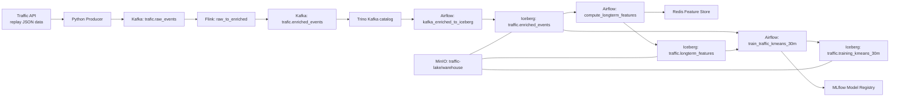

# Big Data Traffic State Pipeline

He thong xu ly trang thai giao thong realtime tai Ha Noi theo kieu lakehouse:
Flink xu ly streaming, Airflow orchestration, Trino query SQL, Iceberg luu bang
tren MinIO, Redis lam online feature store, MLflow quan ly model.

## Architecture



## Data Flow

### Realtime

```text
hanoi_traffic_train_data.json
  -> Traffic API
  -> Python Producer
  -> Kafka [trafic.raw_events]
  -> Flink raw_to_enriched
       lag features + rolling features theo tung tuyen duong
  -> Kafka [trafic.enriched_events]
```

Prediction path dang tat khoi default compose de thiet ke lai.

### Batch And Training

```text
Kafka [trafic.enriched_events]
  -> Trino kafka catalog
  -> Airflow kafka_enriched_to_iceberg
  -> Iceberg [traffic.enriched_events]

Iceberg traffic.enriched_events
  -> Airflow compute_longterm_features
  -> Iceberg [traffic.longterm_features]
  -> Redis Feature Store

Iceberg enriched_events + longterm_features
  -> Airflow train_traffic_kmeans_30m (moi thu Hai, 02:00)
       point-in-time join feature theo route/hour/day_of_week
       ghi debug dataset vao Iceberg [traffic.training_kmeans_30m]
       train KMeans voi 3 cum trang thai
       tinh transition cluster(t) -> cluster(t+30m)
  -> MLflow Registry [traffic_state_kmeans_30m@champion]
```

## KMeans 30-Minute Forecast

KMeans la thuat toan khong giam sat, nen model khong hoc nhan
`target_15m/30m/60m`. Pipeline su dung cach sau:

1. KMeans phan cum cac quan sat giao thong thanh `clear`, `moderate`,
   `congested` dua tren feature realtime va long-term.
2. Tu du lieu lich su, DAG dem chuyen tiep giua cum tai thoi diem `t` va
   cum cung tuyen tai `t + 30 minutes`.
3. Khi inference, Flink xac dinh cum hien tai va dung chuyen tiep pho bien
   nhat de uoc luong trang thai sau 30 phut.

## Services

| Service | Role |
| --- | --- |
| Traffic API | Replay historical traffic JSON as stream-like events |
| Python Producer | Poll API and publish raw Kafka events |
| Kafka | Broker for raw and enriched topics |
| Flink | Enrich events with state/window features |
| MinIO | Object store for Iceberg warehouse and MLflow artifacts |
| Iceberg REST | Iceberg catalog backed by Postgres metadata |
| Trino | SQL engine for Kafka and Iceberg |
| Airflow | Run Trino ingest/query jobs, compute features and train KMeans |
| Redis | Online long-term feature store |
| MLflow | Experiment tracking and registered KMeans model |
| Redpanda Console | Kafka monitoring UI |

## Local UIs

| UI | URL |
| --- | --- |
| Airflow | http://localhost:8080 |
| Flink | http://localhost:8081 |
| Redpanda Console | http://localhost:8082 |
| Trino | http://localhost:18083 |
| MLflow | http://localhost:15000 |
| MinIO Console | http://localhost:19001 |

## Huong Dan Chay Chi Tiet

### 1. Mo PowerShell Tai Thu Muc Du An

```powershell
cd D:\Downloads\big-data-project-pipeline-master\big-data-project-pipeline-master
```

Kiem tra Docker va cau hinh Compose:

```powershell
docker version
docker compose config --quiet
```

### 2. Build Image

```powershell
docker compose build
```

Buoc nay build cac image Airflow, Flink, Traffic API, Producer va MLflow.

### 3. Khoi Dong Ha Tang Nen

Chua bat producer va job prediction o buoc nay, de model duoc train truoc khi
luong du doan bat dau ghi ket qua.

```powershell
docker compose up -d kafka minio redis mlflow airflow traffic-api redpanda-console flink-jobmanager flink-taskmanager
```

Hai service khoi tao `kafka-topic-init` va `minio-init` se duoc chay theo
dependency. Neu chung dung voi trang thai `Exited (0)` thi do la ket qua binh
thuong sau khi tao topic va bucket xong.

Kiem tra trang thai:

```powershell
docker compose ps -a
```

Thong tin dang nhap UI:

| Dich vu | URL | Tai khoan |
| --- | --- | --- |
| Airflow | http://localhost:8080 | `admin` / `admin` |
| Flink | http://localhost:8081 | Khong can |
| MLflow | http://localhost:15000 | Khong can |
| MinIO | http://localhost:19001 | `minioadmin` / `minioadmin` |
| Redpanda Console | http://localhost:8082 | Khong can |

### 4. Kiem Tra DAG Trong Airflow

Mo Airflow UI hoac dung lenh:

```powershell
docker compose exec airflow airflow dags list
docker compose exec airflow airflow dags list-import-errors
```

Can thay cac DAG chinh:

```text
kafka_enriched_to_iceberg
compute_longterm_features
train_traffic_kmeans_30m
```

`kafka_predictions_to_minio_parquet` dang pause/disable vi prediction path dang
duoc thiet ke lai.

### 5. Kiem Tra Realtime Enrich

Default compose da bat `traffic-producer` va `flink-enrich-job-submitter`.
Luong du lieu:

```text
Traffic API
  -> Producer
  -> Kafka [trafic.raw_events]
  -> Flink raw_to_enriched
  -> Kafka [trafic.enriched_events]
```

Kiem tra Flink job:

```powershell
docker compose exec flink-jobmanager flink list
```

Can thay job:

```text
raw-to-enriched-state-window
```

Kiem tra enriched event:

```powershell
docker compose exec kafka kafka-console-consumer `
  --bootstrap-server kafka:29092 `
  --topic trafic.enriched_events `
  --from-beginning `
  --max-messages 3
```

### 6. Nap Enriched Events Vao Iceberg

DAG nay tu chay moi phut. Trigger thu cong:

```powershell
docker compose exec airflow airflow dags trigger kafka_enriched_to_iceberg
```

Kiem tra bang Iceberg qua Trino:

```powershell
docker compose exec trino trino --execute `
  "SELECT count(*), min(event_ts), max(event_ts) FROM iceberg.traffic.enriched_events"
```

### 7. Tinh Long-Term Features Va Ghi Vao Redis

```powershell
docker compose exec airflow airflow dags trigger compute_longterm_features
```

Luong xu ly:

```text
Iceberg [traffic.enriched_events]
  -> Trino SQL tinh long-term features
  -> Iceberg [traffic.longterm_features]
  -> Redis Feature Store
```

Kiem tra:

```powershell
docker compose exec trino trino --execute "SELECT count(*) FROM iceberg.traffic.longterm_features"
docker compose exec redis redis-cli --scan --pattern "traffic:longterm:*" | head
```

### 8. Train Model KMeans Cho Horizon 30 Phut

```powershell
docker compose exec airflow airflow dags trigger train_traffic_kmeans_30m
```

DAG se thuc hien:

```text
Iceberg enriched_events + longterm_features
  -> point-in-time join feature
  -> ghi debug dataset vao Iceberg [traffic.training_kmeans_30m]
  -> train KMeans 3 cum trang thai
  -> hoc transition cluster(t) -> cluster(t+30m)
  -> log model va transition_30m.json vao MLflow
  -> dang ky traffic_state_kmeans_30m@champion
```

Kiem tra dataset train:

```powershell
docker compose exec trino trino --execute "SELECT count(*) FROM iceberg.traffic.training_kmeans_30m"
```

### 9. Kiem Tra Model Tren MLflow

Mo MLflow UI tai:

```text
http://localhost:15000
```

Kiem tra:

```text
Experiment: traffic-state-kmeans-30m
Registered model: traffic_state_kmeans_30m
Alias: champion
Artifact: transition_30m.json
```

## Lenh Chay Nhanh

```powershell
docker compose build

docker compose up -d --build

# Doi mot lat de Kafka/Flink co enriched events.
docker compose exec airflow airflow dags trigger kafka_enriched_to_iceberg
docker compose exec airflow airflow dags trigger compute_longterm_features
docker compose exec airflow airflow dags trigger train_traffic_kmeans_30m
```

## Dung He Thong

Dung va xoa container/network, nhung giu data trong volume:

```powershell
docker compose down
```

Tam dung container, sau do co the bat lai bang `docker compose start`:

```powershell
docker compose stop
docker compose start
```

Dung va xoa toan bo data MinIO, Iceberg catalog, Redis, MLflow va Airflow logs:

```powershell
docker compose down -v
```

Can than voi `-v` vi model va du lieu Iceberg da tao se bi xoa.

## He Thong Co Tu Chay Khong

Sau khi khoi dong bang `docker compose up -d`, viec dong cua so PowerShell
khong lam dung container. Khi cac container dang chay:

| Thanh phan | Hanh vi |
| --- | --- |
| `traffic-producer` | Tiep tuc phat su kien moi giay |
| Flink jobs | Tiep tuc enrich neu job dang active |
| `kafka_enriched_to_iceberg` | Chay moi phut |
| `compute_longterm_features` | Chay moi phut |
| `train_traffic_kmeans_30m` | Chay thu Hai luc `02:00` |
| `kafka_predictions_to_minio_parquet` | Dang pause/disable |

Mot so service co `restart: unless-stopped` se tu khoi dong lai khi Docker
Desktop khoi dong lai. Tuy nhien de dam bao toan bo Kafka/Flink/API va cac
job deu day du sau khi may khoi dong lai, nen kiem tra:

```powershell
docker compose ps -a
```

Neu khong muon pipeline tiep tuc sinh data, dung:

```powershell
docker compose stop
```
