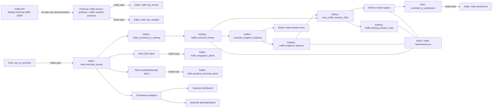

# Big Data Traffic State Pipeline

Hệ thống xử lý trạng thái giao thông thời gian thực cho Hà Nội theo kiến trúc Lakehouse.
Pipeline phối hợp nhiều thành phần: Kafka, Flink, Trino, Iceberg, MinIO, Airflow, Redis, MLflow, ClickHouse, Superset và Streamlit.

## Tổng quan

Mục tiêu của dự án là xây dựng một nền tảng phân tích và dự báo trạng thái giao thông bằng cách:

- phát lại dữ liệu lịch sử từ `hanoi_traffic_train_data.json`
- thu thập sự kiện cảm biến giao thông và thời tiết vào Kafka
- enrich sự kiện bằng Flink với các đặc trưng trượt/lag
- ingest dữ liệu enriched vào Iceberg qua Trino
- tính toán long-term features với Trino
- lưu trữ feature online trong Redis
- huấn luyện mô hình KMeans trạng thái và chuyển tiếp 30 phút bằng Airflow + MLflow
- hỗ trợ báo cáo, dashboard và cảnh báo bằng ClickHouse/Superset/Streamlit

## Kiến trúc hệ thống



## Thành phần chính

- `traffic-api`: replay file `hanoi_traffic_train_data.json` thành API HTTP.
- `traffic-sensor-producer`, `traffic-weather-producer`: đọc API và publish raw events vào Kafka.
- `flink-enrich-job-submitter`: submit job Flink `raw_to_enriched.py` để tạo `trafic.enriched_events`.
- `airflow`: chạy DAG ingest, feature và training.
- `kafka_enriched_to_iceberg`: ingest dữ liệu enriched Kafka vào Iceberg.
- `compute_longterm_features`: tính long-term features và lưu vào Iceberg + Redis.
- `train_traffic_kmeans_30m`: xây dựng dataset, train KMeans và log model vào MLflow.
- `trino`: SQL engine cho Kafka và Iceberg.
- `iceberg-rest`: Iceberg catalog với metadata PostgreSQL và storage MinIO.
- `minio`: object store cho Iceberg, MLflow artifact.
- `mlflow`: experiment tracking và model registry.
- `redis`: online feature store.
- `clickhouse`, `superset`, `streamlit-alert`: analytics và dashboard.
- `redpanda-console`: UI xem Kafka topic.

## Luồng dữ liệu

1. `traffic-api` replay dữ liệu lịch sử.
2. Producer thu thập sensor và weather gửi vào Kafka topic:
   - `trafic.raw_sensor`
   - `trafic.raw_weather`
3. Flink enrich đọc hai topic raw và tạo topic:
   - `trafic.enriched_events`
4. Airflow ingest và persist enriched event vào Iceberg:
   - `iceberg.traffic.enriched_events`
5. Airflow tính toán long-term features và lưu vào:
   - `iceberg.traffic.longterm_features`
   - Redis feature store
6. Airflow train KMeans trạng thái 30 phút, ghi:
   - `iceberg.traffic.training_kmeans_30m`
   - MLflow model registry `traffic_state_kmeans_30m@champion`
7. Flink prediction và alert jobs sinh ra:
   - `trafic.predictions`
   - `trafic.congestion_alerts`
   - `trafic.accident_anomaly_alerts`

## Cổng truy cập local

| Service | URL |
| --- | --- |
| Airflow | http://localhost:8080 |
| Flink JobManager | http://localhost:8081 |
| Redpanda Console | http://localhost:8082 |
| Trino | http://localhost:18083 |
| MLflow | http://localhost:15000 |
| MinIO Console | http://localhost:19001 |
| ClickHouse | http://localhost:18123 |
| Superset | http://localhost:8088 |
| Streamlit Alert | http://localhost:8501 |
| Traffic API | http://localhost:18000 |
| Anomaly API | http://localhost:18010 |

## Khởi động nhanh

### Yêu cầu

- Docker Desktop
- Docker Compose
- Windows PowerShell hoặc terminal tương tự

### 1. Build image

```powershell
docker compose build
```

### 2. Khởi động dịch vụ

Để chạy toàn bộ môi trường, dùng:

```powershell
docker compose up -d --build
```

Nếu muốn chỉ khởi động phần cốt lõi trước,
```powershell
docker compose up -d kafka minio redis mlflow airflow traffic-api redpanda-console flink-jobmanager flink-taskmanager
```

### 3. Kiểm tra trạng thái

```powershell
docker compose ps -a
```

### 4. Kiểm tra DAG Airflow

```powershell
docker compose exec airflow airflow dags list
docker compose exec airflow airflow dags list-import-errors
```

Các DAG chính:

- `kafka_enriched_to_iceberg`
- `compute_longterm_features`
- `train_traffic_kmeans_30m`

## Chạy luồng dữ liệu

### 1. Ingest Kafka -> Iceberg

```powershell
docker compose exec airflow airflow dags trigger kafka_enriched_to_iceberg
```

### 2. Tính long-term features

```powershell
docker compose exec airflow airflow dags trigger compute_longterm_features
```

### 3. Train mô hình

```powershell
docker compose exec airflow airflow dags trigger train_traffic_kmeans_30m
```

## Kiểm tra dữ liệu

- Enriched events trong Iceberg:
  ```powershell
docker compose exec trino trino --execute "SELECT count(*), min(event_ts), max(event_ts) FROM iceberg.traffic.enriched_events"
  ```
- Long-term features:
  ```powershell
docker compose exec trino trino --execute "SELECT count(*) FROM iceberg.traffic.longterm_features"
  ```
- Training dataset:
  ```powershell
docker compose exec trino trino --execute "SELECT count(*) FROM iceberg.traffic.training_kmeans_30m"
  ```

## Dừng và dọn dẹp

- Dừng các container nhưng giữ dữ liệu:
  ```powershell
docker compose down
  ```
- Chỉ tạm dừng:
  ```powershell
docker compose stop
docker compose start
  ```
- Xóa dữ liệu toàn bộ volume (cảnh báo: mất dữ liệu Iceberg/MLflow/Redis/Airflow):
  ```powershell
docker compose down -v
  ```

## Ghi chú

- `docker compose down -v` sẽ xóa toàn bộ dữ liệu lượng chết, bao gồm metadata Iceberg và mô hình MLflow.
- Các service có `restart: unless-stopped` sẽ khởi động lại khi Docker Desktop mở lại.
- Dịch vụ Flink submitter được cấu hình để giữ job chạy dưới dạng detached.
- Các topic Kafka chính hiện tại dùng tiền tố `trafic.*` theo cấu hình trong compose.
