# Big Data Traffic State Pipeline

He thong xu ly trang thai giao thong realtime tai Ha Noi theo kieu Lambda lite:
Flink xu ly streaming, Airflow tinh feature va train KMeans, MLflow quan ly model.

## Architecture

```mermaid
flowchart LR
    API["Traffic API<br/>replay JSON data"] --> Producer["Python Producer"]
    Producer --> Raw["Kafka: trafic.raw_events"]
    Raw --> Enrich["Flink: raw_to_enriched"]
    Enrich --> Enriched["Kafka: trafic.enriched_events"]

    Enriched --> Sink["Airflow: enriched to Parquet"]
    Sink --> Lake["MinIO: enriched_events"]
    Lake --> Features["Airflow: compute_longterm_features"]
    Features --> Redis["Redis Feature Store"]
    Features --> FeatureLake["MinIO: longterm_features"]

    Lake --> Train["Airflow: train_traffic_kmeans_30m"]
    FeatureLake --> Train
    Train --> MLflow["MLflow Model Registry"]

    Enriched --> Predict["Flink: KMeans state transition 30m"]
    Redis --> Predict
    MLflow --> Predict
    Predict --> PredTopic["Kafka: trafic.predictions"]
    PredTopic --> PredSink["Airflow: predictions to Parquet"]
    PredSink --> PredLake["MinIO: predictions"]
```



## Data Flow

### Realtime

```text
hanoi_traffic_train_data.json
  -> Traffic API
  -> Python Producer
  -> Kafka [trafic.raw_events]
  -> Flink raw_to_enriched
       lag features + rolling features theo tung tuyen duong
  -> Kafka [trafic.enriched_events]
  -> Flink enriched_to_predictions
       lookup long-term features trong Redis
       load traffic_state_kmeans_30m@champion tu MLflow
       predict trang thai giao thong sau 30 phut qua bang chuyen cum
  -> Kafka [trafic.predictions]
```

Output prediction chi con horizon 30 phut:

```json
{
  "prediction_30m": {
    "forecast_horizon_minutes": 30,
    "current_cluster": 0,
    "predicted_cluster": 1,
    "traffic_status": "moderate",
    "expected_avg_speed": 25.5,
    "expected_avg_delay_minutes": 4.1,
    "model_status": "loaded"
  }
}
```

### Batch And Training

```text
Kafka [trafic.enriched_events]
  -> Airflow kafka_enriched_to_minio_parquet
  -> MinIO [traffic/enriched_events]

MinIO enriched_events
  -> Airflow compute_longterm_features
  -> MinIO [traffic/longterm_features/staging]
  -> Redis Feature Store

MinIO enriched_events + longterm_features
  -> Airflow train_traffic_kmeans_30m (moi thu Hai, 02:00)
       point-in-time join feature theo route/hour/day_of_week
       train KMeans voi 3 cum trang thai
       tinh transition cluster(t) -> cluster(t+30m)
  -> MLflow Registry [traffic_state_kmeans_30m@champion]
```

## KMeans 30-Minute Forecast

KMeans la thuat toan khong giam sat, nen model khong hoc nhan
`target_15m/30m/60m`. Pipeline su dung cach sau:

1. KMeans phan cum cac quan sat giao thong thanh `clear`, `moderate`,
   `congested` dua tren feature realtime va long-term.
2. Tu du lieu lich su, DAG dem chuyen tiep giua cum tai thoi diem `t` va
   cum cung tuyen tai `t + 30 minutes`.
3. Khi inference, Flink xac dinh cum hien tai va dung chuyen tiep pho bien
   nhat de uoc luong trang thai sau 30 phut.

## Services

| Service | Role |
| --- | --- |
| Traffic API | Replay historical traffic JSON as stream-like events |
| Python Producer | Poll API and publish raw Kafka events |
| Kafka | Broker for raw, enriched and prediction topics |
| Flink | Enrich events and infer the 30-minute state |
| MinIO | Parquet data lake and MLflow artifact storage |
| Airflow | Sink data, compute features and train KMeans |
| Redis | Online long-term feature store |
| MLflow | Experiment tracking and registered KMeans model |
| Redpanda Console | Kafka monitoring UI |

## Local UIs

| UI | URL |
| --- | --- |
| Airflow | http://localhost:8080 |
| Flink | http://localhost:8081 |
| Redpanda Console | http://localhost:8082 |
| MLflow | http://localhost:15000 |
| MinIO Console | http://localhost:19001 |

## Huong Dan Chay Chi Tiet

### 1. Mo PowerShell Tai Thu Muc Du An

```powershell
cd D:\Downloads\big-data-project-pipeline-master\big-data-project-pipeline-master
```

Kiem tra Docker va cau hinh Compose:

```powershell
docker version
docker compose config --quiet
```

### 2. Build Image

```powershell
docker compose build
```

Buoc nay build cac image Airflow, Flink, Traffic API, Producer va MLflow.

### 3. Khoi Dong Ha Tang Nen

Chua bat producer va job prediction o buoc nay, de model duoc train truoc khi
luong du doan bat dau ghi ket qua.

```powershell
docker compose up -d kafka minio redis mlflow airflow traffic-api redpanda-console flink-jobmanager flink-taskmanager
```

Hai service khoi tao `kafka-topic-init` va `minio-init` se duoc chay theo
dependency. Neu chung dung voi trang thai `Exited (0)` thi do la ket qua binh
thuong sau khi tao topic va bucket xong.

Kiem tra trang thai:

```powershell
docker compose ps -a
```

Thong tin dang nhap UI:

| Dich vu | URL | Tai khoan |
| --- | --- | --- |
| Airflow | http://localhost:8080 | `admin` / `admin` |
| Flink | http://localhost:8081 | Khong can |
| MLflow | http://localhost:15000 | Khong can |
| MinIO | http://localhost:19001 | `minioadmin` / `minioadmin` |
| Redpanda Console | http://localhost:8082 | Khong can |

### 4. Kiem Tra DAG Trong Airflow

Mo Airflow UI hoac dung lenh:

```powershell
docker compose exec airflow airflow dags list
```

Can thay bon DAG:

```text
kafka_enriched_to_minio_parquet
compute_longterm_features
train_traffic_kmeans_30m
kafka_predictions_to_minio_parquet
```

### 5. Bat Producer Va Flink Enrich

```powershell
docker compose up -d traffic-producer flink-enrich-job-submitter
```

Luong du lieu luc nay:

```text
Traffic API
  -> Producer
  -> Kafka [trafic.raw_events]
  -> Flink raw_to_enriched
  -> Kafka [trafic.enriched_events]
```

Producer phat mot su kien moi giay, lan luot qua 36 tuyen duong. Flink can
toi thieu 3 ban ghi cua moi tuyen de co rolling feature, vi vay nen doi khoang
3 den 5 phut truoc khi train.

Theo doi log producer:

```powershell
docker compose logs -f traffic-producer
```

Nhan `Ctrl+C` chi thoat man hinh log, khong dung container.

Kiem tra Flink job:

```powershell
docker compose exec flink-jobmanager flink list
```

Can thay job:

```text
raw-to-enriched-state-window
```

### 6. Kiem Tra Enriched Events Trong Kafka

Sau khi producer chay vai phut:

```powershell
docker compose exec kafka kafka-console-consumer `
  --bootstrap-server kafka:29092 `
  --topic trafic.enriched_events `
  --from-beginning `
  --max-messages 3
```

Ban ghi enriched can co cac feature nhu:

```text
prev_avg_speed_1
rolling_avg_speed_3
rolling_delay_3
```

### 7. Luu Enriched Events Vao MinIO

DAG nay tu chay moi phut. De tao du lieu ngay lap tuc, trigger thu cong:

```powershell
docker compose exec airflow airflow dags trigger kafka_enriched_to_minio_parquet
```

Sau khi task thanh cong, mo MinIO Console va kiem tra:

```text
traffic-lake/traffic/enriched_events/
```

Thu muc nay se co cac file Parquet dung lam nguon tinh feature va training.

### 8. Tinh Long-Term Features Va Ghi Vao Redis

```powershell
docker compose exec airflow airflow dags trigger compute_longterm_features
```

Luong xu ly:

```text
MinIO [traffic/enriched_events]
  -> DuckDB tinh long-term features
  -> MinIO [traffic/longterm_features/staging]
  -> Redis Feature Store
```

Kiem tra Redis da co feature:

```powershell
docker compose exec redis redis-cli DBSIZE
docker compose exec redis redis-cli --scan --pattern "traffic:longterm:*" COUNT 5
```

Ket qua `DBSIZE` lon hon `0` nghia la feature online da san sang.

### 9. Train Model KMeans Cho Horizon 30 Phut

```powershell
docker compose exec airflow airflow dags trigger train_traffic_kmeans_30m
```

DAG se thuc hien:

```text
MinIO enriched_events + longterm_features
  -> point-in-time join feature
  -> train KMeans 3 cum trang thai
  -> hoc transition cluster(t) -> cluster(t+30m)
  -> log model va transition_30m.json vao MLflow
  -> dang ky traffic_state_kmeans_30m@champion
```

Neu DAG thong bao chua co transition 30 phut, hay de producer chay them vai
phut, roi trigger lai cac buoc luu data, tinh feature va train:

```powershell
docker compose exec airflow airflow dags trigger kafka_enriched_to_minio_parquet
docker compose exec airflow airflow dags trigger compute_longterm_features
docker compose exec airflow airflow dags trigger train_traffic_kmeans_30m
```

### 10. Kiem Tra Model Tren MLflow

Mo MLflow UI tai:

```text
http://localhost:15000
```

Kiem tra:

```text
Experiment: traffic-state-kmeans-30m
Registered model: traffic_state_kmeans_30m
Alias: champion
Artifact: transition_30m.json
```

### 11. Bat Job Prediction Realtime

Chi bat job nay sau khi MLflow da co model `@champion`:

```powershell
docker compose up -d flink-predict-job-submitter
```

Kiem tra tren Flink UI hoac chay:

```powershell
docker compose exec flink-jobmanager flink list
```

Can thay them job:

```text
enriched-to-kmeans-state-prediction-30m
```

### 12. Kiem Tra Prediction Trong Kafka

```powershell
docker compose exec kafka kafka-console-consumer `
  --bootstrap-server kafka:29092 `
  --topic trafic.predictions `
  --from-beginning `
  --max-messages 5
```

Output du kien:

```json
{
  "prediction_30m": {
    "forecast_horizon_minutes": 30,
    "current_cluster": 0,
    "predicted_cluster": 1,
    "traffic_status": "moderate",
    "expected_avg_speed": 25.5,
    "expected_avg_delay_minutes": 4.1,
    "model_status": "loaded"
  }
}
```

Neu output co `"model_status": "unavailable"`, model chua duoc job Flink tai.
Sau khi DAG train thanh cong, huy job prediction cu tren Flink UI neu da ton
tai, sau do submit lai:

```powershell
docker compose stop flink-predict-job-submitter
docker compose up -d flink-predict-job-submitter
```

### 13. Luu Prediction Vao MinIO

DAG prediction sink mac dinh chay luc `23:59` moi ngay. De kiem tra ngay:

```powershell
docker compose exec airflow airflow dags trigger kafka_predictions_to_minio_parquet
```

Mo MinIO Console va kiem tra:

```text
traffic-lake/traffic/predictions/
```

File Parquet ket qua gom cac cot:

```text
forecast_horizon_minutes
current_cluster
predicted_cluster
traffic_status
expected_avg_speed
expected_avg_delay_minutes
model_status
```

## Lenh Chay Nhanh

```powershell
docker compose build

docker compose up -d kafka minio redis mlflow airflow traffic-api redpanda-console flink-jobmanager flink-taskmanager

docker compose up -d traffic-producer flink-enrich-job-submitter

# Doi 3 den 5 phut de co du du lieu.

docker compose exec airflow airflow dags trigger kafka_enriched_to_minio_parquet
docker compose exec airflow airflow dags trigger compute_longterm_features
docker compose exec airflow airflow dags trigger train_traffic_kmeans_30m

# Kiem tra MLflow da co model @champion, sau do bat prediction.

docker compose up -d flink-predict-job-submitter
docker compose exec airflow airflow dags trigger kafka_predictions_to_minio_parquet
```

## Dung He Thong

Dung va xoa container/network, nhung giu data trong volume:

```powershell
docker compose down
```

Tam dung container, sau do co the bat lai bang `docker compose start`:

```powershell
docker compose stop
docker compose start
```

Dung va xoa toan bo data MinIO, Redis, MLflow va Airflow logs:

```powershell
docker compose down -v
```

Can than voi `-v` vi model va du lieu Parquet da tao se bi xoa.

## He Thong Co Tu Chay Khong

Sau khi khoi dong bang `docker compose up -d`, viec dong cua so PowerShell
khong lam dung container. Khi cac container dang chay:

| Thanh phan | Hanh vi |
| --- | --- |
| `traffic-producer` | Tiep tuc phat su kien moi giay |
| Flink jobs | Tiep tuc enrich va prediction neu job dang active |
| `kafka_enriched_to_minio_parquet` | Chay moi phut |
| `compute_longterm_features` | Chay moi phut |
| `train_traffic_kmeans_30m` | Chay thu Hai luc `02:00` |
| `kafka_predictions_to_minio_parquet` | Chay moi ngay luc `23:59` |

Mot so service co `restart: unless-stopped` se tu khoi dong lai khi Docker
Desktop khoi dong lai. Tuy nhien de dam bao toan bo Kafka/Flink/API va cac
job deu day du sau khi may khoi dong lai, nen kiem tra:

```powershell
docker compose ps -a
```

Neu khong muon pipeline tiep tuc sinh data, dung:

```powershell
docker compose stop
```
