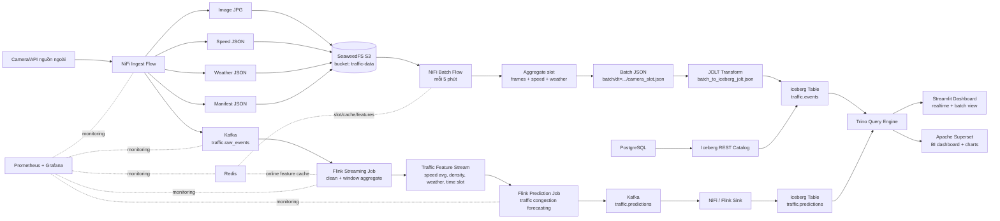

```mermaid
flowchart LR
    A[Camera/API nguồn ngoài] --> B[NiFi Ingest Flow]

    B --> C1[Image JPG]
    B --> C2[Speed JSON]
    B --> C3[Weather JSON]
    B --> C4[Manifest JSON]

    C1 --> S3[(SeaweedFS S3<br/>bucket: traffic-data)]
    C2 --> S3
    C3 --> S3
    C4 --> S3

    S3 --> D[NiFi Batch Flow<br/>mỗi 5 phút]
    D --> E[Aggregate slot<br/>frames + speed + weather]
    E --> F[Batch JSON<br/>batch/dt=.../camera_slot.json]

    F --> G[JOLT Transform<br/>batch_to_iceberg_jolt.json]
    G --> H[Iceberg Table<br/>traffic.events]

    K[PostgreSQL] --> L[Iceberg REST Catalog]
    L --> H

    %% Realtime branch
    B --> M[Kafka<br/>traffic.raw_events]
    M --> P[Flink Streaming Job<br/>clean + window aggregate]
    P --> Q[Traffic Feature Stream<br/>speed avg, density, weather, time slot]
    Q --> R[Flink Prediction Job<br/>traffic congestion forecasting]
    R --> S[Kafka<br/>traffic.predictions]

    %% Prediction sink
    S --> T[NiFi / Flink Sink]
    T --> U[Iceberg Table<br/>traffic.predictions]

    %% Query and dashboards
    H --> I[Trino Query Engine]
    U --> I

    I --> J[Streamlit Dashboard<br/>realtime + batch view]
    I --> V[Apache Superset<br/>BI dashboard + charts]

    N[Redis] -. slot/cache/features .- D
    N -. online feature cache .- P

    O[Prometheus + Grafana] -. monitoring .- B
    O -. monitoring .- M
    O -. monitoring .- N
    O -. monitoring .- P
    O -. monitoring .- R
```
